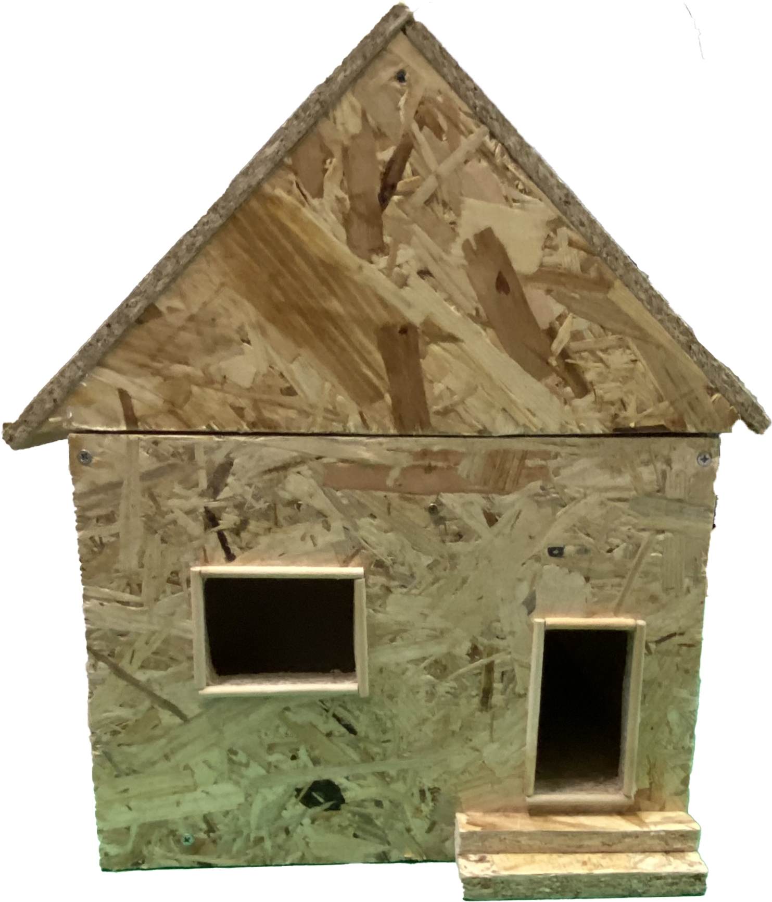
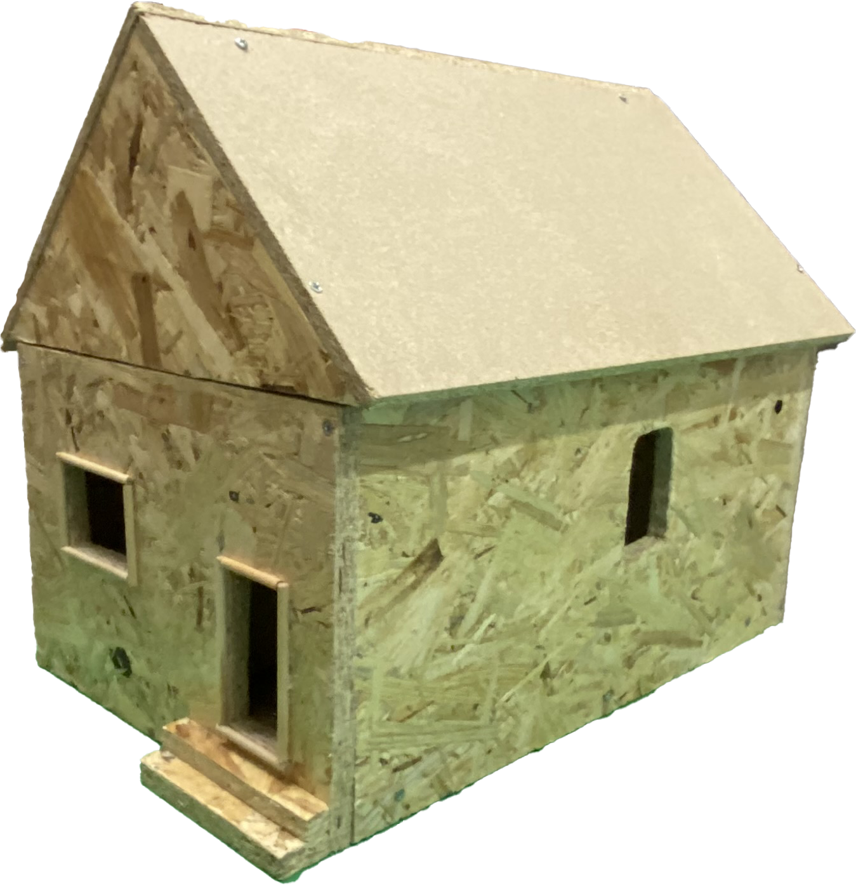
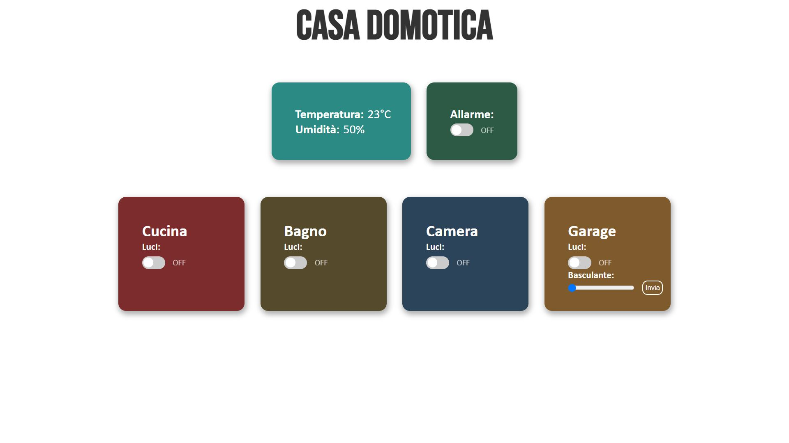

# Casa Domotica (Progetto Telecomunicazioni)

Codice backend e frontend della casa domotica (progetto telecomunicazioni).

## Table of Contents
- [Description](#description)
- [Features](#features)
- [Hardware Components](#hardware-components)
- [Software Requirements](#software-requirements)
- [Setup and Usage](#setup-and-usage)
- [Images](#images)

## Description
This project implements a home automation system using an Arduino for hardware control and a Python-based backend application for the web interface. Communication between the Python application and the Arduino board is handled over Bluetooth via an HC-05 module.

## Features
- **Lighting Control:** Toggle LEDs representing different rooms (Kitchen, Bathroom, Bedroom, Garage).
- **Garage Door Control:** Uses a Stepper motor to control and monitor the opening percentage of the garage door (basculante).
- **Environment Monitoring:** Reads the room's temperature and humidity using a DHT11 sensor.
- **Alarm System:** A fully functional burglar alarm system that activates a buzzer sound.
- **Web Interface:** A frontend built with HTML, JS, and CSS, served using the Python Eel library. This interface allows users to monitor and interact with the connected Arduino components seamlessly.

## Hardware Components
- Arduino Board
- HC-05 Bluetooth Module
- DHT11 Temperature and Humidity Sensor
- Stepper Motor (for the Garage Door)
- LEDs (simulating room lights)
- Buzzer (for the Alarm system)

## Software Requirements
- Arduino IDE (to upload the C++ sketch)
- Python 3.x
- Python packages required: `eel`, `pyserial`, `pygame`

## Setup and Usage
1. Upload the `main/main.ino` sketch to your Arduino board.
2. Ensure the HC-05 Bluetooth module is successfully paired with your computer and bound to a specific COM port.
3. Edit the `port` variable inside `webapp/main.py` and `bluetooth.py` to match the correct COM port assigned to the modulo on your computer (e.g., `COM4` or `COM6`).
4. To launch the fully-featured web application, run:
   ```bash
   python webapp/main.py
   ```
5. To launch the basic Pygame interface, run:
   ```bash
   python bluetooth.py
   ```

## Images




